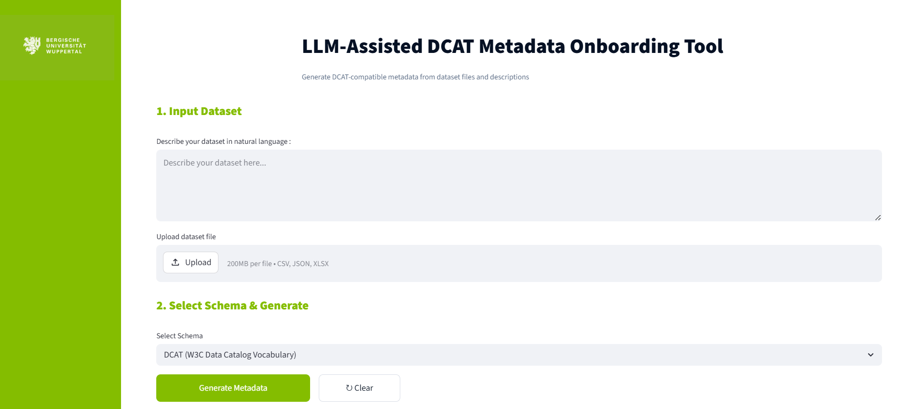
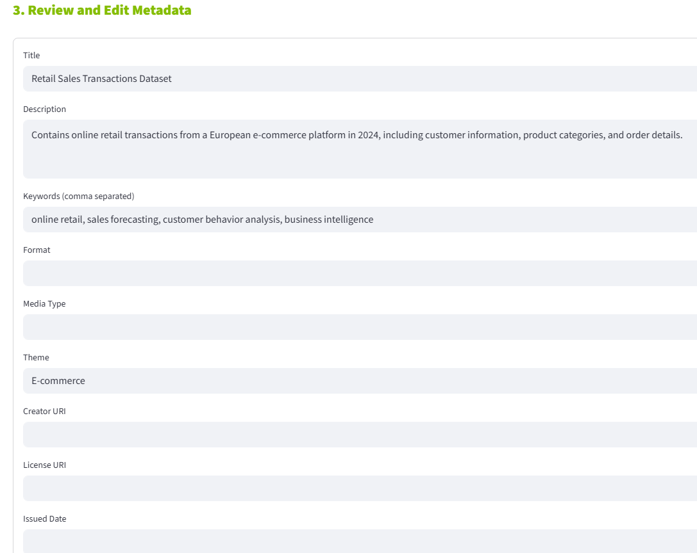
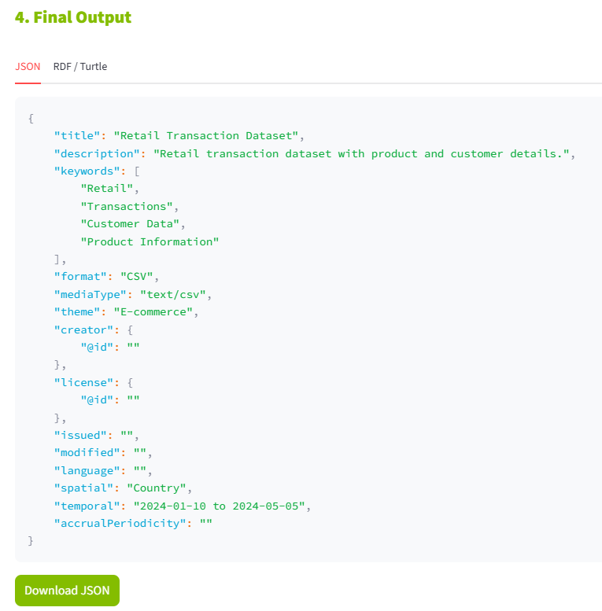
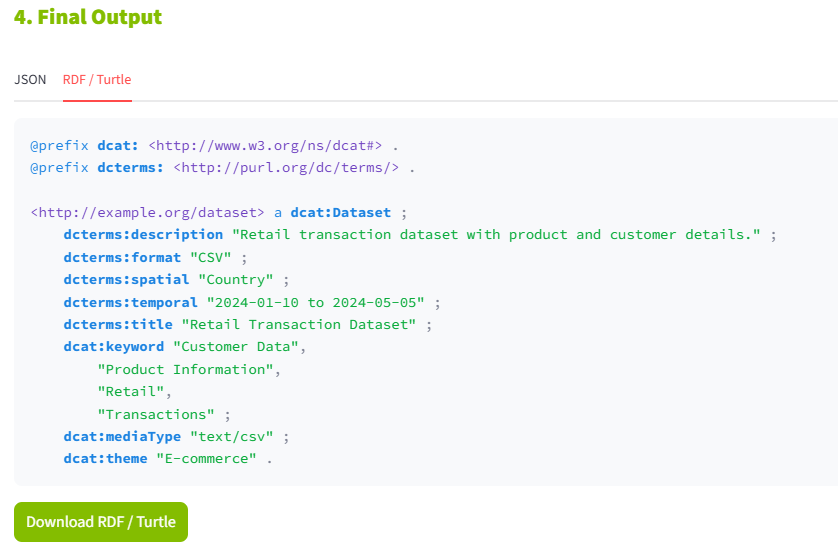

# LLM-Assisted DCAT Metadata Onboarding Tool

A prototype for automatically generating **DCAT-compliant metadata** using a **Large Language Model (LLM)**.

---

# Overview

The **LLM-Assisted DCAT Metadata Onboarding Tool** is a Streamlit-based web application developed to simplify the creation of **DCAT-compliant metadata** for datasets.

Instead of requiring users to manually create metadata using Semantic Web technologies, the application automatically generates metadata from a natural language dataset description, an uploaded dataset file, or a combination of both. The generated metadata can be reviewed, edited, and exported in both **JSON** and **RDF/Turtle** formats.

The tool is intended for researchers, data providers, and organizations that want to prepare datasets for publication in data catalogs or data spaces without requiring extensive knowledge of DCAT, RDF, or Linked Data technologies.

---

# Features

The prototype currently provides the following functionality:

- Generate DCAT-compatible metadata from a dataset description.
- Upload datasets in **CSV**, **JSON**, or **XLSX** format.
- Automatically analyze the dataset structure.
- Detect temporal and spatial information when available.
- Generate metadata using a locally hosted **Llama 3.2** model through **Ollama**.
- Review and edit the generated metadata before export.
- Export metadata as **JSON** and **RDF/Turtle**.

---

# Workflow

The metadata onboarding process follows the workflow below.

```text
Dataset Description / Dataset File
                │
                ▼
      Automatic Dataset Analysis
                │
                ▼
      Llama 3.2 Metadata Generation
                │
                ▼
        User Review & Validation
                │
                ▼
      JSON + RDF/Turtle Export
```

---

# System Requirements

Before running the application, install the following software.

| Software | Purpose |
|----------|---------|
| Python 3.10 or later | Executes the application |
| Ollama | Hosts the local language model |
| Llama 3.2 | Generates metadata |
| Streamlit | Provides the graphical user interface |
| Pandas | Dataset analysis |
| RDFLib | RDF/Turtle generation |
| Requests | Communication with Ollama |

---

# Installation

## 1. Clone the repository

```bash
git clone https://github.com/arijsmida/llm-dcat-metadata-onboarding-tool.git
cd llm-dcat-metadata-onboarding-tool
```

## 2. Create a Python virtual environment (recommended)

### Windows

```bash
python -m venv venv
venv\Scripts\activate
```

### Linux/macOS

```bash
python3 -m venv venv
source venv/bin/activate
```

## 3. Install the required Python packages

```bash
pip install -r requirements.txt
```

or

```bash
pip install streamlit pandas requests rdflib openpyxl
```

## 4. Install Ollama

Download and install Ollama from:

https://ollama.com

## 5. Download the language model

```bash
ollama pull llama3.2
```

## 6. Ensure the Ollama server is running

Before launching the application, ensure that the Ollama server is running. If it is not already active, start it by executing:

```bash
ollama serve
```

Keep this terminal open while using the application.

---

# Running the Application

Open a **new terminal**, activate the virtual environment if necessary, and launch the application.

### Windows

```bash
venv\Scripts\activate
streamlit run app.py
```

### Linux/macOS

```bash
source venv/bin/activate
streamlit run app.py
```

The application will automatically open in your default web browser.

---

# Quick Start

The following example demonstrates the typical workflow of the application.

## Step 1 – Provide Dataset Information

The user starts by entering a dataset description, uploading a supported dataset file (CSV, JSON, or XLSX), or combining both sources of information.

Example description:

> This dataset contains online retail transactions from a European e-commerce platform. It includes customer information, purchased products, quantities, prices, and transaction dates.



*Figure 1. Main interface of the metadata onboarding tool.*

---

## Step 2 – Generate Metadata

Click **Generate Metadata**.

The application analyzes the uploaded dataset, combines the extracted dataset profile with the provided description, and sends the request to the locally hosted **Llama 3.2** model through **Ollama**.

The model generates a DCAT-compatible metadata draft that can be reviewed before export.

---

## Step 3 – Review and Edit Metadata

The generated metadata is displayed in an editable form.

Users can review and modify fields including:

- Title
- Description
- Keywords
- Theme
- Language
- Spatial Coverage
- Temporal Coverage
- Media Type

This validation step ensures that the generated metadata accurately represents the dataset before it is exported.

<p align="center">

</p>

<p align="center">
<b>Figure 2.</b> Generated metadata displayed for user review.
</p>

---

## Step 4 – Export Metadata

After confirming the metadata, the application generates:

- **dcat_metadata.json**
- **dcat_metadata.ttl**

### JSON Output

The JSON output contains the generated DCAT-compatible metadata in a structured format. In this example, the tool generated metadata for a retail sales transactions dataset, including the title, description, keywords, theme, and other DCAT-related fields.

<p align="center">

</p>

<p align="center">
<b>Figure 3.</b> Generated metadata in JSON format.
</p>

### RDF/Turtle Output

The application also generates an RDF/Turtle representation using the DCAT vocabulary. This semantic representation can be integrated into data catalogs and other metadata management systems that support RDF.

<p align="center">

</p>

<p align="center">
<b>Figure 4.</b> Generated metadata in RDF/Turtle format.
</p>


---

# Supported Input

| Input | Supported |
|------|-----------|
| CSV | ✓ |
| JSON | ✓ |
| XLSX | ✓ |
| Dataset Description | ✓ |

---

# Output

The application generates the following files.

| File | Description |
|------|-------------|
| dcat_metadata.json | JSON representation of the generated metadata |
| dcat_metadata.ttl | RDF/Turtle representation using the DCAT vocabulary |

---


# Current Limitations

The current prototype supports only the **DCAT** metadata schema and accepts datasets in **CSV**, **JSON**, and **XLSX** formats. Metadata fields such as creator, publisher, or license require explicit user input when they cannot be inferred from the dataset or its description.

---

# Future Work

Future work will focus on supporting additional domain-specific metadata standards and dataset formats. Another important direction is the integration of metadata validation using **SHACL** to verify the generated RDF metadata and ensure compliance with **DCAT** and **DCAT-AP** specifications before publication. Further improvements include multilingual metadata generation and enhanced user feedback mechanisms.

---


# License

This project was developed as part of academic research at the **University of Wuppertal**.