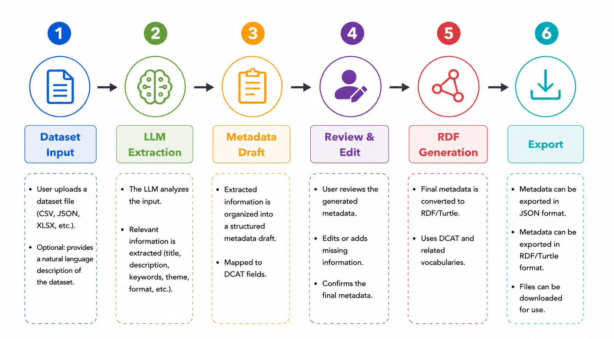

# Software Architecture

## 1. Project Overview

The **LLM-Assisted DCAT Metadata Onboarding Tool** is a web-based application developed using **Python** and **Streamlit**. The application assists users in generating high-quality **DCAT-compatible metadata** from dataset descriptions and uploaded datasets. A locally hosted Large Language Model (LLM) executed through **Ollama** is used to automate metadata generation. Before exporting the metadata, users can review and modify the generated values to ensure correctness.

# 2. Software Architecture

The application follows a **modular software architecture**, where the user interface, business logic, configuration, styling, and utility functions are separated into dedicated packages. This separation improves readability, maintainability, scalability, and code reusability.

The project is divided into the following modules:

* Components
* Services
* Configuration
* Utilities
* Styles
* Assets

Each module has a clearly defined responsibility.

# 3. Project Structure

LLM-DCAT-METADATA-ONBOARDING-TOOL/
│
├── app.py
├── requirements.txt
├── .gitignore
│
├── assets/
│   └── uni_logo.png
│
├── components/
│   ├── layout.py
│   ├── input_section.py
│   ├── analysis_section.py
│   ├── generation_section.py
│   ├── review_section.py
│   ├── output_section.py
│   └── __init__.py
│
├── config/
│   ├── settings.py
│   └── __init__.py
│
├── services/
│   ├── dataset_analyzer.py
│   ├── llm_generator.py
│   ├── metadata_cleaner.py
│   ├── rdf_exporter.py
│   └── __init__.py
│
├── styles/
│   ├── css.py
│   └── __init__.py
│
├── utils/
│   ├── image_utils.py
│   └── __init__.py
│
└── docs/
    ├── architecture.md
    └── screenshots/
        ├── 01_workflow.png
        ├── 02_home_page.png
        ├── 03_metadata_review.png
        ├── 04_json_output.png
        └── 05_rdf_output.png

# 4. Package Description

## app.py

Acts as the application's entry point. It initializes Streamlit, coordinates the workflow, and connects all user interface components.

---

## components/

This package contains all user interface components.

### layout.py

Responsible for rendering the overall application layout, including the sidebar, logo, page title, and global styling.

### input_section.py

Displays the dataset description field and file upload component.

### analysis_section.py

Displays the extracted dataset statistics and analysis results.

### generation_section.py

Controls the metadata generation process and communicates with the LLM service.

### review_section.py

Allows users to review and manually edit generated metadata before confirmation.

### output_section.py

Displays the final JSON and RDF/Turtle output and provides download functionality.

---

## services/

Contains the application's business logic.

### dataset_analyzer.py

Analyzes uploaded datasets and extracts structural metadata including file format, media type, temporal coverage, spatial information, and dataset statistics.

### llm_generator.py

Builds the prompt, communicates with the local Ollama server, and converts the LLM response into structured JSON metadata.

### metadata_cleaner.py

Validates and cleans the generated metadata by combining LLM output with detected dataset information.

### rdf_exporter.py

Transforms the final metadata into RDF/Turtle using the DCAT vocabulary.

---

## config/

Contains centralized application configuration.

### settings.py

Stores global configuration values such as the Ollama model, timeout, API endpoint, supported file types, and application settings.

---

## utils/

Contains reusable helper functions.

### image_utils.py

Converts images into Base64 format for displaying the application logo.

---

## styles/

Contains the application's CSS styling.

### css.py

Defines the custom visual appearance of the Streamlit interface.

---

## assets/

Contains static resources used by the application, such as the university logo.

---

# 5. Application Workflow

The following diagram illustrates the overall workflow of the application.

**Figure 1.** Application workflow of the LLM-Assisted DCAT Metadata Onboarding Tool.

The application follows the workflow illustrated above:

1. The user enters a dataset description and/or uploads a dataset file.
2. The Dataset Analyzer extracts structural information from the uploaded dataset.
3. The extracted dataset profile together with the user description is passed to the Large Language Model.
4. The LLM generates DCAT-compatible metadata.
5. The generated metadata is validated and cleaned.
6. The user reviews and edits the metadata if necessary.
7. The application exports the final metadata as JSON and RDF/Turtle.

---

# 7. Technologies Used

| Technology   | Purpose                         |
| ------------ | ------------------------------- |
| Python       | Programming language            |
| Streamlit    | Web application framework       |
| Pandas       | Dataset processing and analysis |
| Requests     | Communication with Ollama       |
| RDFLib       | RDF/Turtle generation           |
| Ollama       | Local Large Language Model      |
| DCAT         | Metadata standard               |
| JSON         | Metadata serialization          |
| Turtle (TTL) | RDF serialization               |

